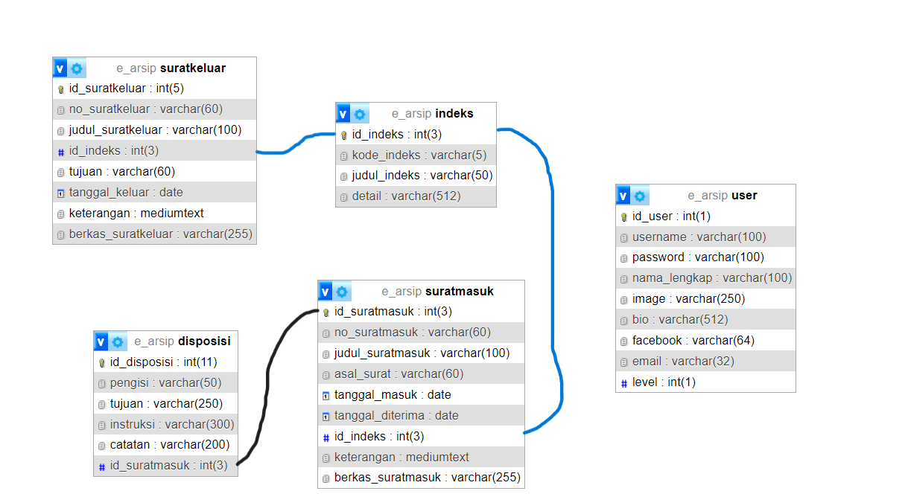
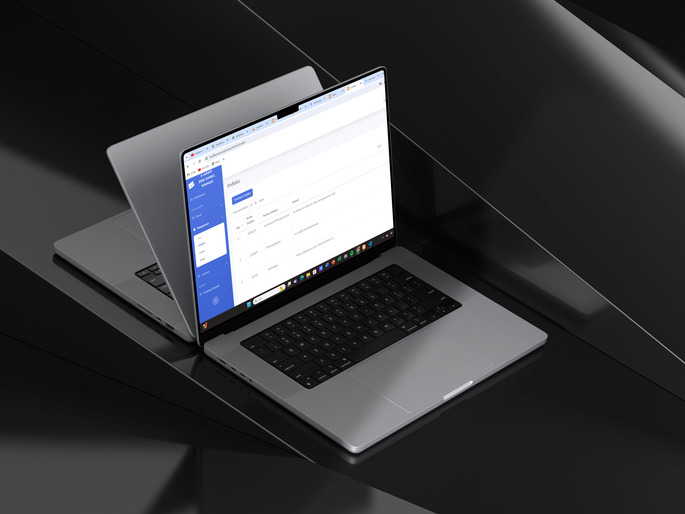
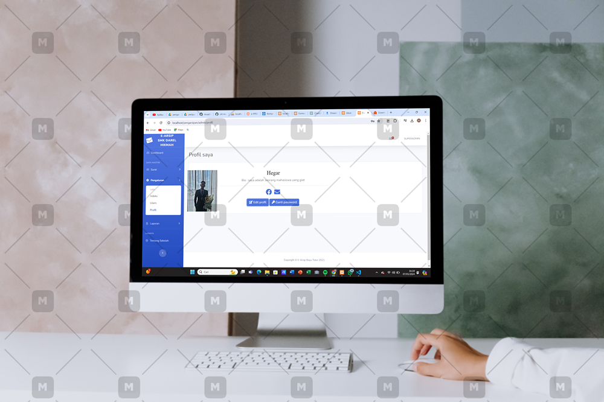
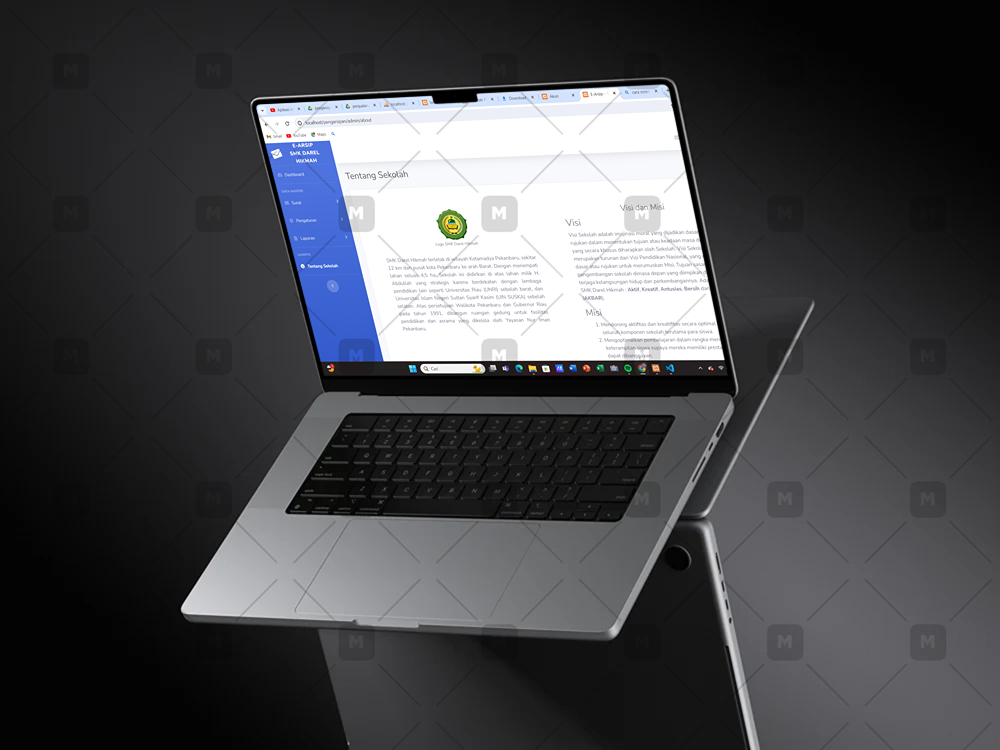

# SISTEM PENGARSIPAN
|                    | Anggota                                  |
|--------------------|------------------------------------------|
|                    | Mohamad Hegar Sukmana Wibowo (312210332) |
|                    | Yudha Purnama Putra (312210352)          |
|                    | Hendra Parsaulian (312210689)            |
|                    | Naza Sefti Prianita (312210306)          |
| Link web hoating   | http://kelompok6.biz.id/                 |
| Kelas              | TI.22.A.3                                |
| Tugas              | UTS PEMOGRAMAN WEB 2                     |
# A. Gambaran Umum Sistem
aplikasi yang menghimpun informasi yang tertera pada fisik arsip. Sistem ini dirancang untuk
memudahkan pengarsipan dan pengelolaan arsip secara elektronik, mempercepat proses pencarian
informasi, dan meningkatkan efisiensi dalam pengelolaan arsip. Dalam beberapa implementasi, sistem
e-arsip berbasis web telah dikembangkan untuk meningkatkan kemudahan dan akurasi dalam
pengelolaan arsip, serta memungkinkan akses yang lebih cepat dan efektif.
# B. Kebutuhan Sistem
a. Functional (Use Case)
1. use case
2. Flowchart
3. b. Non-Functional
• Security: Kebutuhan keamanan yang terintegrasi dalam sistem e-arsip untuk melindungi data
yang disimpan dan menghindari akses tidak sah.
• Interface: Kebutuhan tampilan antarmuka yang user-friendly dan mudah digunakan, serta
konsistensi dalam desain dan warna yang digunakan.
• Performance: Kebutuhan performa yang baik dalam sistem e-arsip untuk memastikan bahwa
aplikasi dapat diakses dengan cepat dan efisien, serta dapat menangani volume data yang
besar.
# C. Rancangan Sistem
1. Analisis Kebutuhan
2. Perancangan Basis Data
3. Antarmuka Pengguna
4. Manajemen Identitas dan Keamanan
5. Pengindeksan dan Pencarian
6. Penyimpanan dan Pemeliharaan
7. Manajemen Siklus Hidup Dokumen
8. Integrasi dengan Sistem Lain
9. Pengembangan dan Pengujian
10. Pelatihan Pengguna
# D. Rancangan Basis Data (Data Model/ERD)

# E. Prototype (Desain Mockup/Figma)
## Login

## Halaman Utama

## Surat Masuk

## Surat Keluar

## Indeks

## Users

## Profil

## Laporan Surat Masuk

## Laporan Surat Keluar

## Tentang Sekolah

